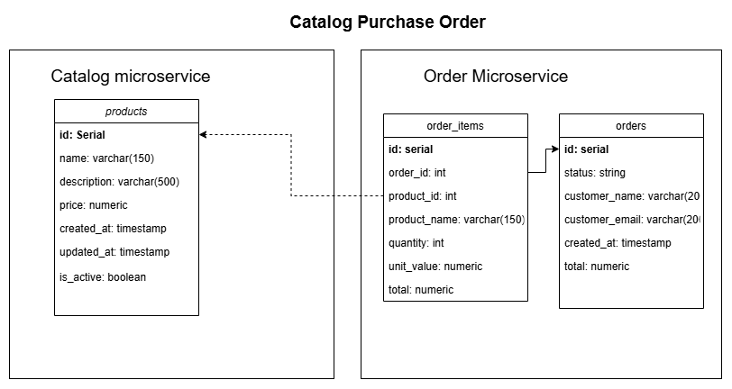
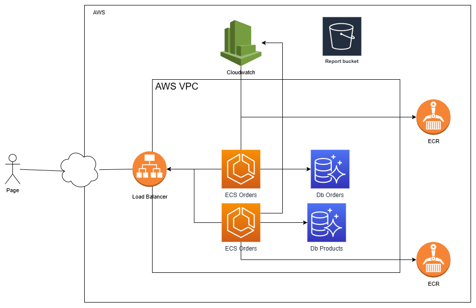

# Gestion de Articulos y Ordenes
## Introduccion

This project consists of two APIs for product and order management made in .net 8.0
* catalog api: Managing of products
* order api: Managing of Orders

## Features

- Creation of products
- Get products by pagination
- Get product by idetifier
- Update product
- Deleting  Products
- Creating and updating order
- Approval Orders
- Cancell Orders
- Managing items in the order (Add, Update, Remove, List)

## Tech

Ecommerce project uses next technologies:

- [Net 8.0] - Programing Languague
- [Entity Framework] - ORM management Database
- [FluentValidator] - Validation Data
- [Docker] - Distribuition of software


## Installation

```sh
git clone https://github.com/nestorrojas07/eCommerce.git
cd eCommerce
docker-compose up --build
```
[Products swagger](http://localhost:8090/swagger/index.html)
[Orders swagger](http://localhost:8091/swagger/index.html)

## Architecture

uml models


AWS proposal infraestructure


[diagrams documentation](./e-commerce-diagrams.drawio)


## License

MIT

**Free Software, Hell Yeah!**

[//]: # (These are reference links used in the body of this note and get stripped out when the markdown processor does its job. There is no need to format nicely because it shouldn't be seen. Thanks SO - http://stackoverflow.com/questions/4823468/store-comments-in-markdown-syntax)

   [dill]: <https://github.com/joemccann/dillinger>
   [git-repo-url]: <https://github.com/joemccann/dillinger.git>
   [john gruber]: <http://daringfireball.net>
   [df1]: <http://daringfireball.net/projects/markdown/>
   [markdown-it]: <https://github.com/markdown-it/markdown-it>
   [Ace Editor]: <http://ace.ajax.org>
   [node.js]: <http://nodejs.org>
   [Twitter Bootstrap]: <http://twitter.github.com/bootstrap/>
   [jQuery]: <http://jquery.com>
   [@tjholowaychuk]: <http://twitter.com/tjholowaychuk>
   [express]: <http://expressjs.com>
   [AngularJS]: <http://angularjs.org>
   [Gulp]: <http://gulpjs.com>

   [PlDb]: <https://github.com/joemccann/dillinger/tree/master/plugins/dropbox/README.md>
   [PlGh]: <https://github.com/joemccann/dillinger/tree/master/plugins/github/README.md>
   [PlGd]: <https://github.com/joemccann/dillinger/tree/master/plugins/googledrive/README.md>
   [PlOd]: <https://github.com/joemccann/dillinger/tree/master/plugins/onedrive/README.md>
   [PlMe]: <https://github.com/joemccann/dillinger/tree/master/plugins/medium/README.md>
   [PlGa]: <https://github.com/RahulHP/dillinger/blob/master/plugins/googleanalytics/README.md>
